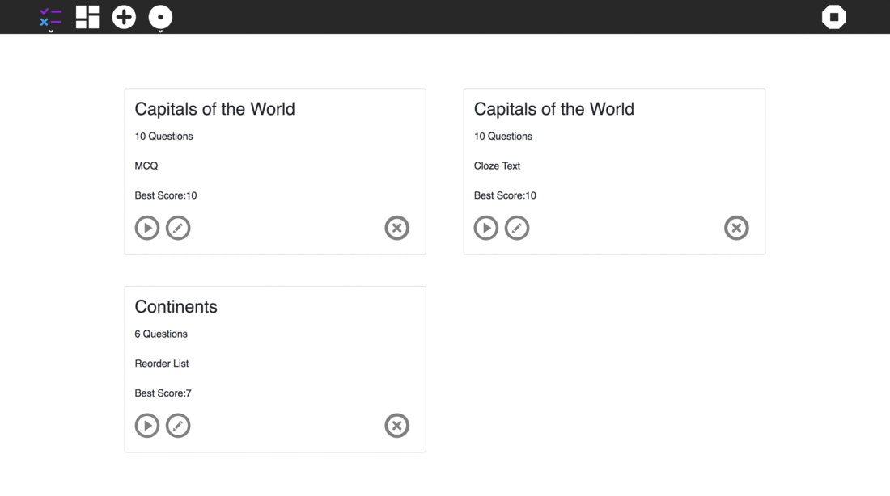

## Sugariser Exerciser Activity

### GSoC 2018 project for Sugar Labs

Student: [Mankirat Singh](https://github.com/manki11)<br/>
Mentor : [Lionel Laské](https://github.com/llaske)

The Sugarizer Exerciser Activity is an Academic focused Activity for the Sugarizer Platform. It provides Teachers to build interactive Exercises for students, using multiple templates, and share them with their Students using the sugarizer-server.



### Steps to run project

Make sure npm and nodejs are installed on your machine.

Clone the repository on your local machine and run.

```bash
npm install
```

#### Setting up the development environment

Copy the lib folder, inside the main directory of the project folder, into the node_modules folder (after npm install). These are dependencies required by the sugarizer platform.

#### Running the project

##### As a React App (No Sugarizer Features):

```bash
npm run start
```

##### As a Sugarizer Activity inside Sugarizer:
This step requires sugarizer. The steps to get Sugarizer working on your machine can be found here:
[Sugarizer](https://github.com/llaske/sugarizer)

###### Build the Activity

```bash
npm run build
```

The built activity can now be found inside the build folder.

###### Deploy Activity:

Copy the contents of the build folder and paste them inside the activity folder corresponding to Exerciser (/activities/Exerciser.activity), inside Sugarizer.

Restart Sugarizer


## Contributing

1. Fork it (<https://github.com/manki11/ExerciserReact/fork>)
2. Create your feature branch (`git checkout -b feature/feature_name`)
3. Commit your changes (`git commit -am 'Add some feature'`)
4. Push to the branch (`git push origin feature/feature_name`)
5. Create a new Pull Request

## LICENSE

[](https://opensource.org/licenses/Apache-2.0)

This repository is Licensed under ```Apache v2``` license.
